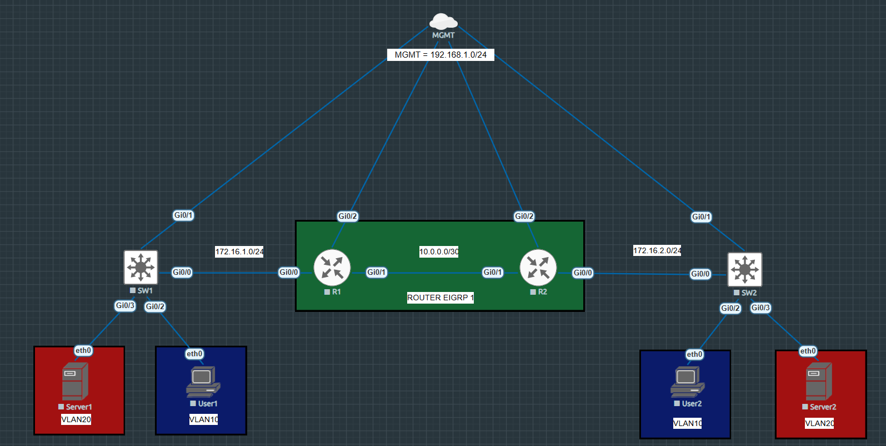

# Network Automation Lab

This repository is my personal sandbox to learn network automation using Ansible to configure Cisco routers and switches. With automation becoming an essential skill in modern network engineering and certifications like CCNP emphasizing it, I wanted a practical way to build hands-on experience automating network device configurations.

---

## What This Lab Does

This lab automates the following core network tasks on Cisco IOS devices:

- **Switch Configuration**  
  - Create VLANs  
  - Configure access and trunk ports  

- **Router Configuration**  
  - Assign IP addresses to interfaces  
  - Configure EIGRP routing protocol  

- **Persistence**  
  - Save running configurations to startup-config to ensure changes are retained on reload  

The primary goal of this lab is to practice using Ansible for network automation, not to master VLANs or EIGRP themselves. This project is a playground to learn how to write and run Ansible playbooks for network devices.

---

## Network Topology

The lab network consists of:

- **Routers:** R1, R2  
- **Switches:** SW1, SW2  
- **Connectivity:** Routers connected to switches with appropriate VLAN segmentation for testing configuration deployment  



---

## Repository Structure

```plaintext
network-automation-lab/
├── ansible.cfg            # Ansible configuration file
├── inventory/             # Inventory with device IPs and connection variables
│   └── hosts.yaml
├── playbooks/             # Playbooks directory
│   ├── site.yaml          # Main playbook for device configuration
│   └── verify.yaml        # Playbook for post-deployment verification tasks
├── group_vars/            # Group variables for devices
│   ├── cisco.yaml
├── README.md              # This file
├── notes/                 # Personal notes, explanations, and learning resources related to this lab
└── images/                # Folder for topology diagrams and screenshots
